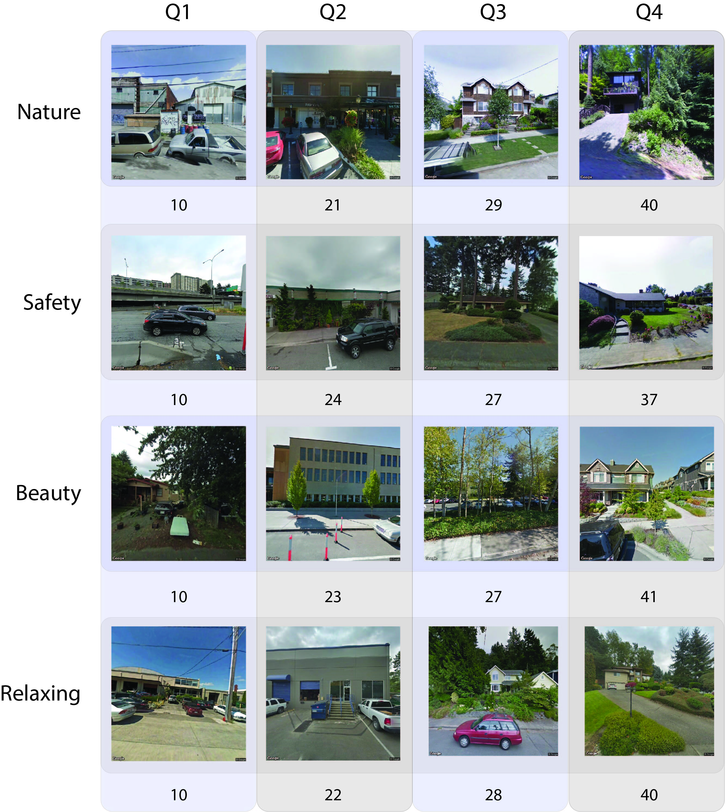

# Perceptions_MTurk
 Collect perceptions of the urban built environment using Amazon mechanical turk

**Author:** [Andrew Larkin](linkedin.com/in/andrew-larkin-525ba3b5)  
**Principal Investigator:** [Perry Hystad](https://health.oregonstate.edu/people/perry-hystad)  
**Summary:** Create standardized methodology for capturing perceptions of street view locations using [Google Street View](https://www.google.com/streetview/) and [Amazon Mechanical Turk](https://www.mturk.com/).  Novel components of standardized methodology include:
* adjust for differences between road and compass heading while standardizing viewing angles
* creating training image sets that maximize distribution of built environment features
* select image comparison pairs with dyanmically updated trueskill scores
* adjust for personal bias using QA/QC questions and intravote variance for each participant

**Repository Files**  
* [dataFiles](./dataFiles) - the training dataset and documentation files
* [statisticalAnalysis](./statisticalAnalysis) - analyze developed methods and output products
* [surveyBackend](./surveyBackend) - server used to distribute sampled image comparisons and collect participant respones
* [surveyClient](./surveyClient) - React-based client to run survey in web browser
* [lib](./lib) - library of custom classes
* [imageSelection](./imageSelection) - methods to sample and select GSV images for the training dataset

**Additional Resources**
1. [Spatial Health Lab](https://health.oregonstate.edu/labs/spatial-health) - Oregon State University
2. [Amazon Mechanical Turk](https://www.mturk.com/) - used to recruit participants to the study
3. [Google Street View](https://www.google.com/streetview/) - standardized database of street view imagery
2. Todo: enter link to Ajay's github repo
