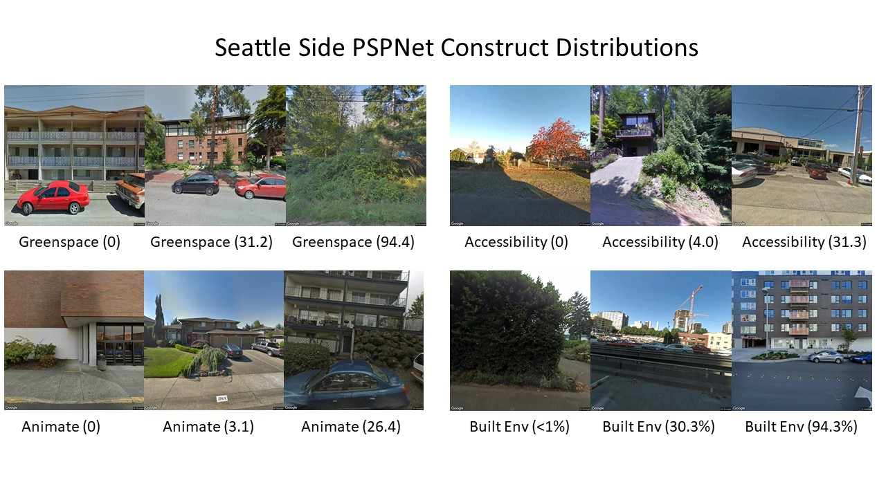

### jupyter noetbooks and python scripts for downloading and selecting training images ###

**Author:** [Andrew Larkin](linkedin.com/in/andrew-larkin-525ba3b5)  
**Principal Investigator:** [Perry Hystad](https://health.oregonstate.edu/people/perry-hystad)  
**Summary:** Mechanical turk votes, trueskill scores, and PSPNet values for the training image dataset 

**Files:**  
* [CreateTrainingRandomSample.ipynb](./CreateTrainingRandomSample.ipynb) - Create a grid of GSV image ids 
* [DownloadedImagesWithFixedAngles.ipynb](./DownloadedImagesWithFixedAngles.ipynb) - download images from GSV with a straight or side viewing angle
* [HistogramImageSets.ipynb](./HistogramImageSets.ipynb) - create histograms of PSPNet characteristics distributions 
* [initializeMTSQL.ipynb](./initializeMTSQL.ipynb) - create and populate SQL database for mechanical turk survey collection
* [sampleByPSP.py](./sampleByPSP.py) - subset the training dataset by optimizing uniform distribution of PSPNet characteristics
