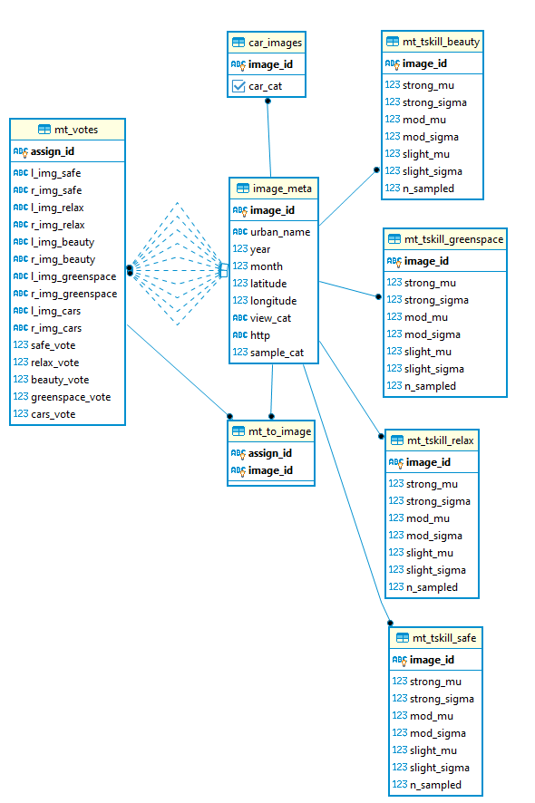

### Backend component of the mechanical turk survey using RESTful operations  ###

**Operations include:**  
* requesting HITs from Amazon mechanical turk
* handling requests for a survey from client (GET operation)
* process submissions from client (POST operation)`

**files:**  
* [DataDictionary_May15_20.odt](./DataDictionary_May16_20.odt) - data dictionary for the backend SQL database
* [backendERD_May16_20.png](./backendERD_May16_20.png) - Entity Relationship Diagram for the backend SQL database
* [MechTurkBackend.ipynb](./MechTurkBackend.ipynb) - script for making requests for hits to Amazon Mechanical Turk
* [FlaskBackend.py](./FlaskBackend.py) - Restful server to handle mechanical turk sample requests and submissions
