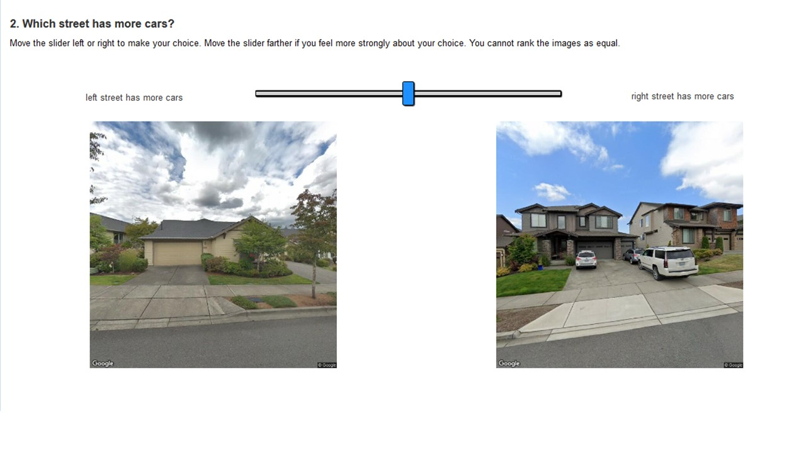

### web-based client for participants to fill out the mechanical turk survey ###

**Author:** [Andrew Larkin](linkedin.com/in/andrew-larkin-525ba3b5)  
**Principal Investigator:** [Perry Hystad](https://health.oregonstate.edu/people/perry-hystad)  
**Summary:** A react-based website for participants to sample and submit surveys via mechanical turk

**Repository Files**  
* [public](./public/) - public folder of the react app.  Contains the home index page and styling
* [src](./src) - src folder of the react app.  Contains the react app and underlying components
* [package.json](./package.json) - defines project requirements (i.e. other react modules)
* [package-lock.json](./package-lock.json) - more comprehensive documentation of project requirements
* [server.js](./server.js) - run the app as an express server
